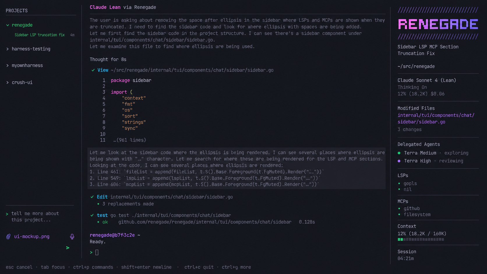
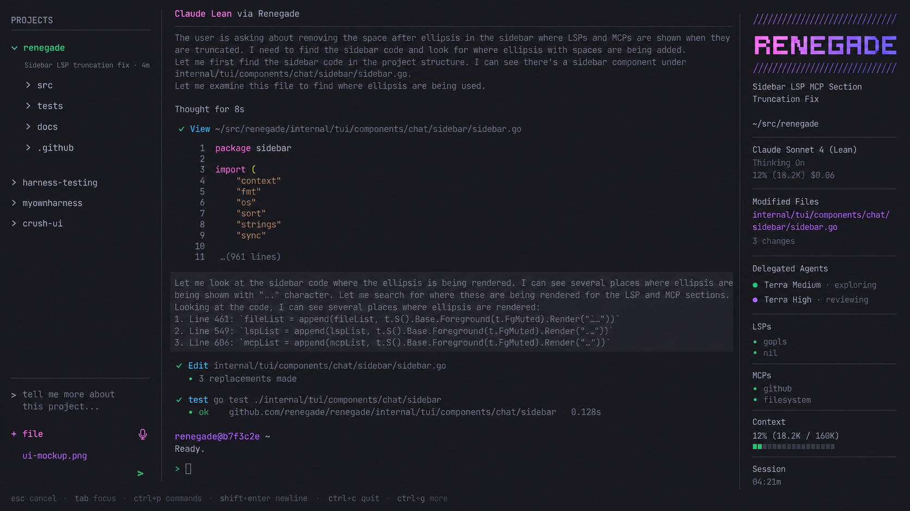
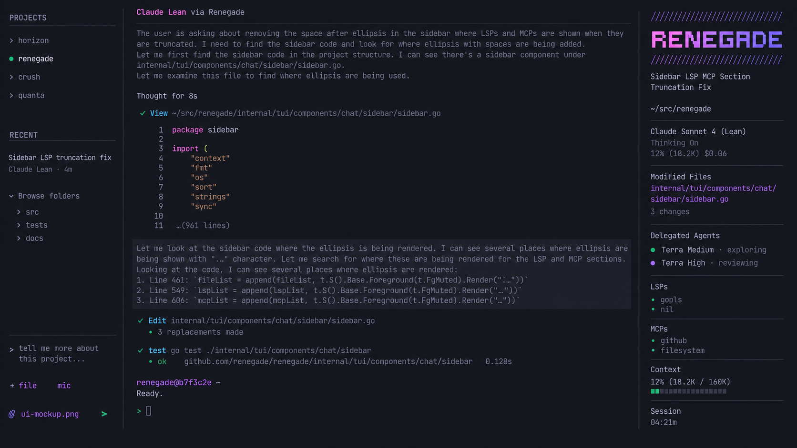

# Renegade command center mockups

These three directions combine Crush's terminal-inspired visual language with a lighter Codex-style project and session picker.

## Option 1

[Open full-size Option 1](./renegade-command-center-option-1.png)

## Option 2

[Open full-size Option 2](./renegade-command-center-option-2.png)

## Option 3

[Open full-size Option 3](./renegade-command-center-option-3.png)

